<div align="center">

<!-- PROJECT LOGO WILL BE ADDED HERE -->

# 👁️ NETRA

## See. Detect. Protect.

### An AI-Powered Intelligent Surveillance & Emergency Response System

</div>

> NETRA is an AI-powered intelligent surveillance and emergency response system designed to enhance safety through real-time monitoring and smart threat detection. It uses computer vision to analyze live environments, detect potential threats, recognize SOS gestures, and generate timely alerts to enable faster emergency response.

<div align="center">


<br>


</div>

---

## ✨ Key Features

### 👁️ Real-Time Surveillance
Monitors live video feeds and analyzes the environment in real time using AI-powered computer vision.

### 🧍 Intelligent Person Detection
Detects people within the monitored environment and improves situational awareness.

### 🧠 AI-Powered Pose Analysis
Analyzes human body movements and poses to identify important or unusual situations.

### 🆘 SOS Gesture Recognition
Recognizes emergency SOS gestures and identifies situations where immediate assistance may be required.

### 🚨 Smart Threat Detection
Detects potential threats or suspicious activities to support timely action.

### 🔔 Real-Time Alerts
Generates alerts when important events, threats, or emergency signals are detected.

### 📹 Live Camera Monitoring
Supports continuous monitoring through live camera feeds.

### ⚡ Intelligent Event Processing
Processes detected events and sends relevant information to the connected system.

### 🛡️ Emergency Response Support
Helps improve response time by providing intelligent detection and timely alerts during critical situations.

---

## 🎥 Demo & Screenshots
<p align="center">

### 🖥️ NETRA Dashboard

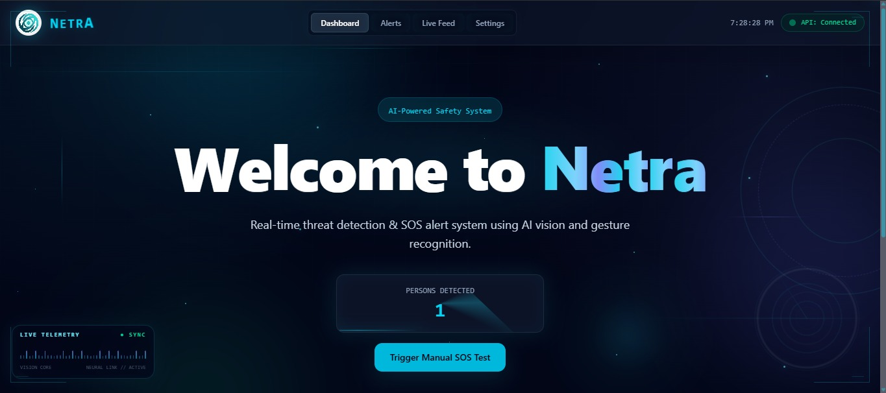

<br><br>

### 👁️ Live Monitoring

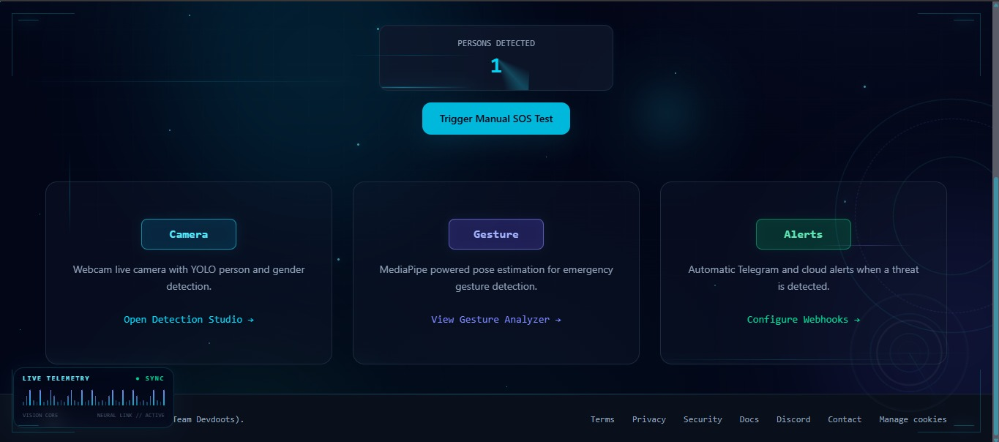

<br><br>

### 🚨 Alerts & Threat Logs

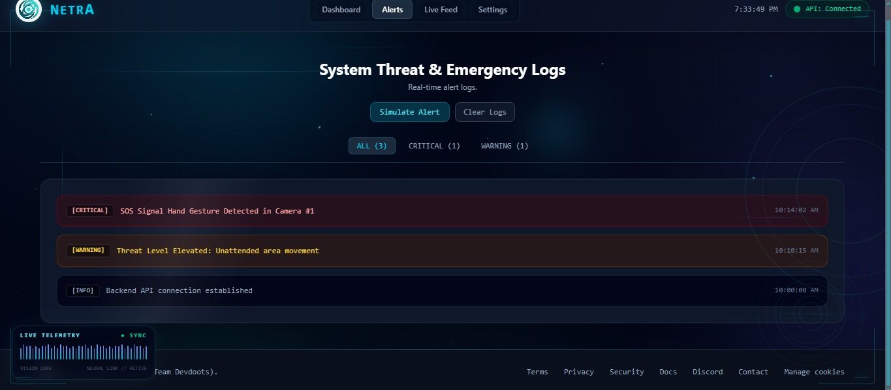

<br><br>

### ⚙️ System Configuration

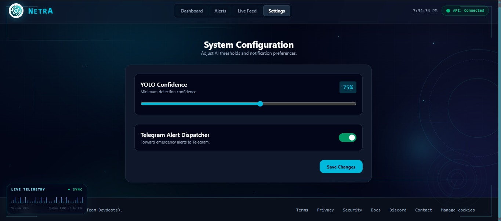

<br><br>

### ⏳ Alert Processing

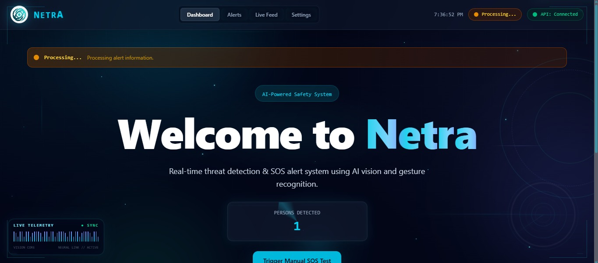

<br><br>

### 🆘 Emergency Threat Detection

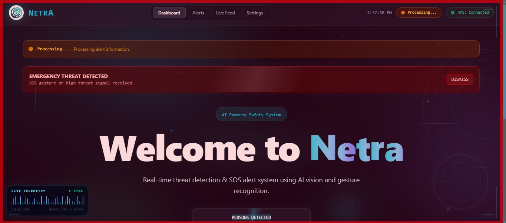

</p>

## 🎬 NETRA Demo

### 🎥 Demo 1

<p align="center">
  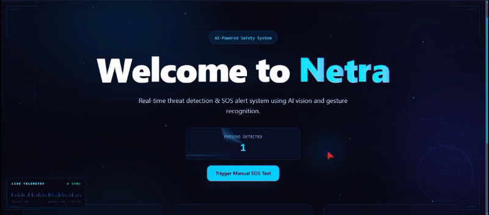
</p>

### 🎥 Demo 2

<p align="center">
  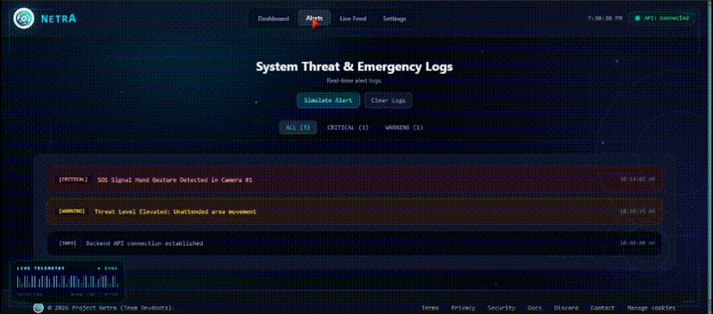
</p>

### 🎥 Demo 3

<p align="center">
  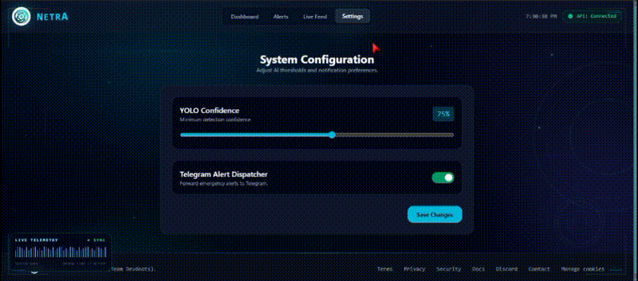
</p>

### 🎥 Demo 4

<p align="center">
  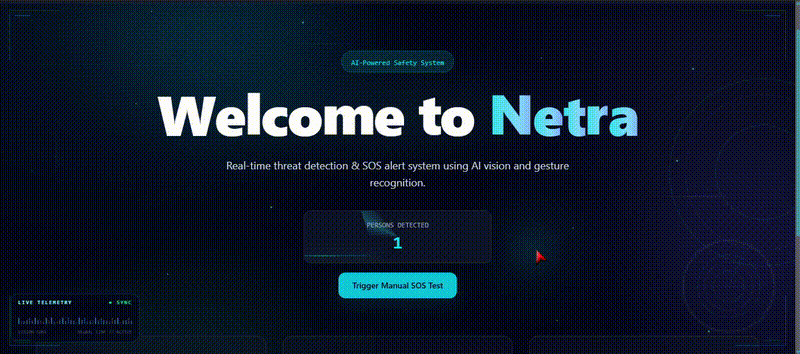
</p>

### 🎥 Demo 5

<p align="center">
  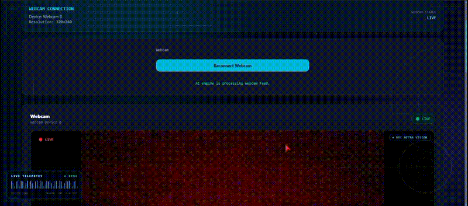
</p>

## 🛠️ Tech Stack

### 🎨 Frontend

<p>
  
</p>

### ⚙️ Backend

<p>
  
</p>

### 🤖 AI & Computer Vision

- 🧠 **YOLO**
- 👁️ **OpenCV**
- 🧍 **MediaPipe**

### 🔧 Development Tools

<p>
  
</p>

---

## ⚙️ Installation

### 📋 Prerequisites

Before getting started, make sure you have the following installed:

- 🐍 Python 3.x
- 🟢 Node.js & npm
- 📦 Git

---

### 1️⃣ Clone the Repository

```bash
git clone https://github.com/Devdootjii/Devdoots_Netra.git
```

---

### 2️⃣ Navigate to the Project Directory

```bash
cd Devdoots_Netra
```

---

### 3️⃣ Navigate to the Project Setup

```bash
cd Day1_Project_Setup
```

---

### 4️⃣ Create a Virtual Environment

```bash
python -m venv .venv
```

---

### 5️⃣ Activate the Virtual Environment

#### Windows

```bash
.venv\Scripts\activate
```

#### Linux / macOS

```bash
source .venv/bin/activate
```

---

## 📖 Usage

### 1️⃣ Start the NETRA System

Make sure the required NETRA components are running.

For Windows, you can start the system using:

```bash
start_netra.bat
```

---

### 2️⃣ Configure the Camera

Check the camera configuration file:

```text
camera_config.json
```

Make sure the correct camera settings are configured before starting the monitoring system.

---

### 3️⃣ Start Live Monitoring

Once the NETRA system is running, start the live monitoring process.

The system processes the camera feed and analyzes the environment in real time.

---

### 4️⃣ AI Detection

NETRA uses AI-powered computer vision to analyze the live environment and detect important events.

The system can process:

- 👤 Person Detection
- 🧍 Pose Analysis
- 🆘 SOS Gesture Recognition
- 🚨 Potential Threats

---

### 5️⃣ Event Detection & Processing

When an important event is detected, the system processes the event and prepares the relevant information for further action.

```text
Camera Feed
     ↓
AI Detection
     ↓
Event Analysis
     ↓
Threat / SOS Detection
     ↓
Alert Processing
```

---

### 6️⃣ Emergency Alert

When a critical event or emergency signal is detected, NETRA can trigger the connected alert and response workflow.

> ⚠️ The available alert behavior depends on the configured components and environment.

---

## 🎯 Typical Workflow

```text
1. Start NETRA
        ↓
2. Configure Camera
        ↓
3. Start Live Monitoring
        ↓
4. AI Analyzes Environment
        ↓
5. Event or Threat Detected
        ↓
6. Alert Processing
        ↓
7. Emergency Response Support
```

---

## 📁 Project Structure

```text
Devdoots_Netra/
│
├── Day1_Project_Setup/
│   │
│   ├── aryan_task/          # Frontend / UI Components
│   ├── balram_task/         # AI Processing Tasks
│   ├── divyansh_backend/    # Backend Services
│   ├── khushi_task/         # Alert / Security Components
│   ├── models/              # AI Models
│   ├── rajbhar_datasets/    # Datasets
│   ├── riesh_task/          # AI / System Tasks
│   │
│   ├── camera_config.json   # Camera Configuration
│   ├── start_netra.bat      # Windows Startup Script
│   └── README.md            # Project Documentation
│
└── Additional project files
```

---

## 👥 Meet the Team

<div align="center">

### 🚀 Team Devdoots

</div>

| Member | Role |
|--------|------|
| 👨‍💻 **Divyansh** | Backend Development |
| 🤖 **Harsh** | AI / ML & Software Development |
| 🎨 **Aryan** | Frontend Development |
| 🧠 **Balram** | AI / Computer Vision |
| ⚙️ **Akshuu** | System / Cloud Engineering |
| 🔔 **Khushi** | Alert & Security System |

---

### 🤝 Our Mission

> **Building innovative technology solutions that solve real-world problems and create a safer future.**

<div align="center">

Made with ❤️ by **Team Devdoots**

</div>

---

## 🚀 Future Roadmap

NETRA is continuously evolving. Here are some planned improvements for future versions:

### 🔮 Planned Features

- [ ] 🤖 Advanced AI-based threat detection
- [ ] 🧠 Improved human activity recognition
- [ ] 🆘 More advanced SOS and emergency gesture detection
- [ ] 📱 Mobile application integration
- [ ] ☁️ Cloud-based monitoring and deployment
- [ ] 🔔 Advanced real-time notification system
- [ ] 📊 Advanced analytics dashboard
- [ ] 🗺️ Multi-camera monitoring support
- [ ] 🔐 Improved security and authentication
- [ ] 🌐 Remote monitoring capabilities

---

### 🎯 Our Vision

> To build an intelligent and reliable AI-powered surveillance system that can help create safer environments through real-time detection, analysis, and emergency response support.

---

## 🤝 Contributing

Contributions are welcome and appreciated! 🎉

If you would like to contribute to **NETRA**, please follow these steps:

### 1️⃣ Fork the Repository

Create your own copy of this repository by clicking the **Fork** button on GitHub.

### 2️⃣ Clone Your Fork

```bash
git clone https://github.com/YOUR-USERNAME/Devdoots_Netra.git
```

### 3️⃣ Create a New Branch

```bash
git checkout -b feature/your-feature-name
```

### 4️⃣ Make Your Changes

Add your feature, improvement, or bug fix to the project.

### 5️⃣ Commit Your Changes

```bash
git add .
git commit -m "Add: your feature description"
```

### 6️⃣ Push Your Changes

```bash
git push origin feature/your-feature-name
```

### 7️⃣ Create a Pull Request

Submit a Pull Request describing your changes.

---

### 💡 Contribution Ideas

You can contribute by:

- 🐛 Reporting bugs
- 💡 Suggesting new features
- 🧠 Improving AI models
- 🎨 Improving the user interface
- 📖 Improving documentation
- 🔒 Improving security
- ⚡ Optimizing system performance

> Thank you for helping make **NETRA** better! ❤️

---

## 📜 License

This project is licensed under the MIT License.

You are free to use, modify, and distribute this project under the terms of the MIT License.

For more information, see the [LICENSE](LICENSE) file.

---

<div align="center">

### 👁️ NETRA

**See. Detect. Protect.**

Built with ❤️ by **Team Devdoots**

⭐ If you like this project, consider giving it a star!

</div>
